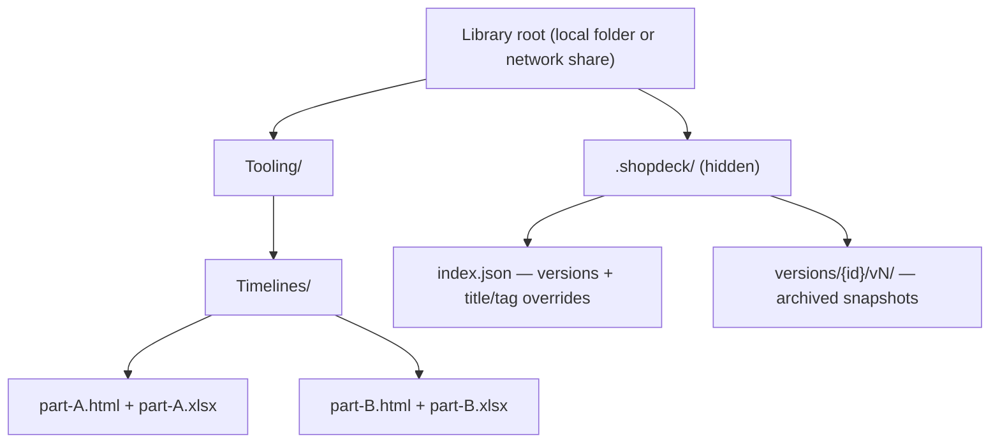

# ShopDeck

**A desktop library for interactive work-item modules** — self-contained HTML
documents that ShopDeck stores, organizes in a nested folder tree, version-tracks,
and opens at full fidelity. Point it at a local folder or a network share and
everyone gets the same organized, searchable library.

[](https://github.com/AxialForge/shopdeck/actions/workflows/release.yml)
[](https://github.com/AxialForge/shopdeck/releases/latest)

[](LICENSE)

The first module type is manufacturing **tool-swap timelines** (forged-part
die-set removal history), but ShopDeck is content-agnostic: **any** self-contained
HTML file that carries a small manifest works — a checklist, a report, a
dashboard, whatever comes next.

---

## Contents

- [Why ShopDeck](#why-shopdeck)
- [Features](#features)
- [How it works](#how-it-works)
- [Install](#install)
- [Quick start (from source)](#quick-start-from-source)
- [Using ShopDeck](#using-shopdeck)
- [Configuration](#configuration)
- [The module contract](#the-module-contract)
- [Project structure](#project-structure)
- [Building &amp; releasing](#building--releasing)
- [Roadmap](#roadmap)
- [Documentation](#documentation)
- [Contributing](#contributing)
- [License](#license)

---

## Why ShopDeck

Teams build rich, interactive one-page HTML documents (Gantt-style timelines,
reports, dashboards) but then have nowhere good to *keep* them: they scatter
across email, network folders, and desktops, with no history when they're
rebuilt and no easy way to find the right one. ShopDeck is the shell around them —
a shared, searchable, version-tracked library that opens each document exactly as
authored.

Design principles:

- **The filesystem is the source of truth.** The folders you make *are* the
  organization; modules are just files in them. Nothing is locked inside an opaque
  database, and it works the same on a local disk or a network share.
- **Never modify the content.** ShopDeck displays module files byte-for-byte and
  keeps its own metadata (versions, edits) in a hidden sidecar. Your documents are
  never rewritten.
- **No database, no native modules.** Pure files + JSON index. Nothing to compile,
  trivial to back up, portable across machines.

## Features

- **Nested folder organization** — the selected library root's own folder tree is
  the navigation (Main › Sub › Files), mirrored live and editable in-app.
- **Full-fidelity viewing** — open a module in its own window with all its
  interactivity (zoom, filter, hover) intact.
- **Version history** — rebuild a module and ShopDeck keeps every past version;
  history survives even when a newer file is dropped on the share out-of-app.
- **Editable metadata** — rename a module or retag it in-app; saved as overrides,
  the source file untouched.
- **Search &amp; filter** — by part / title / tag, sorted by updated / name / size.
- **Local or network-share library** — point the root at a shared drive so a whole
  team reads one library.
- **Three themes** — light, grey, black (AxialForge royal-blue accent).
- **Manual updater** — a one-click *Check for updates* against GitHub Releases;
  nothing phones home on its own.

## How it works



- **Folders = organization.** ShopDeck scans the root and mirrors its folder tree
  as the sidebar. Make/rename folders in-app and they're real folders on disk.
- **Modules = files.** Each module is one self-contained `.html` file carrying a
  `module-manifest` JSON block. An optional same-named source file (e.g. the
  `.xlsx` it was built from) rides along.
- **`.shopdeck/` = everything ShopDeck adds.** A hidden folder inside the root
  holds the version index and archived snapshots, plus your title/tag edits. Module
  files are never modified. See [docs/ARCHITECTURE.md](docs/ARCHITECTURE.md).

## Install

Grab the latest build from **[Releases](https://github.com/AxialForge/shopdeck/releases/latest)**:

- `shopdeck-<version>-setup.exe` — installer (recommended; supports in-app updates).
- `shopdeck-<version>-portable.exe` — single-file portable build (no updater).

Requirements: **Windows 10/11**. On first launch ShopDeck creates its library at
`Documents\ShopDeck Library`; change it any time in **Settings → Library folder**.

## Quick start (from source)

Prerequisites: **Node.js 22+** and **Git**.

```bash
git clone https://github.com/AxialForge/shopdeck.git
cd shopdeck
npm install
node node_modules/electron/install.js   # if the Electron binary didn't auto-download
npm run seed                            # optional: load the sample timeline modules
npm run dev                             # launch the app with hot reload
```

See [docs/BUILDING.md](docs/BUILDING.md) for the full dev, build, and release flow.

## Using ShopDeck

- **Browse** the folder tree on the left; the breadcrumb shows where you are.
- **Open** a module by clicking its card — it opens full-screen in its own window.
- **Search** and **sort** from the toolbar; filter by clicking **tags**.
- **Import** copies a module (and its sibling source) into the current folder;
  re-importing a bumped version keeps the old one as history.
- **Edit** a card to rename it or change its tags (saved app-side, file untouched).
- **New folder** creates real folders to organize into.
- **Settings** holds the library location, theme, and the update checker.

Full walkthrough: [docs/USER-GUIDE.md](docs/USER-GUIDE.md).

## Configuration

App settings persist to `settings.json` in Electron's `userData` directory
(`%APPDATA%\shopdeck` on Windows):

| Key | Meaning |
|-----|---------|
| `libraryRoot` | Absolute path to the library folder (local or UNC network share). |
| `theme` | `light` \| `grey` \| `black`. |
| `showUpdater` | Set `false` to hide the update checker. The `SHOPDECK_NO_UPDATES` env var forces it off regardless. |

## The module contract

Any HTML file that embeds this block in its `<head>` is a valid module:

```html
<script type="application/json" id="module-manifest">
{
  "schema": 1,
  "id": "tool-swap-timeline_40-1471-01",
  "type": "tool-swap-timeline",
  "title": "Tool Swap Timeline — 40-1471-01",
  "version": 1,
  "created": "2026-07-29",
  "updated": "2026-07-29",
  "category": "Tooling",
  "tags": ["blocker", "finish"],
  "fields": { "part": "40-1471-01", "events": 68 }
}
</script>
```

ShopDeck reads **only** the manifest to catalog a module. Same `id` + a higher
`version` = a new version of the same module. Full field reference and authoring
guide: **[docs/MODULE-SPEC.md](docs/MODULE-SPEC.md)**.

## Project structure

```
shopdeck/
├─ electron/
│  ├─ main.js           Electron main: windows, IPC, settings
│  ├─ preload.js        contextBridge → window.shopdeck (the only renderer surface)
│  ├─ library.js        Pure-Node storage: scan, versioning, overrides, import
│  └─ updater.js        Manual electron-updater (no auto checks)
├─ src/renderer/
│  ├─ index.html        Renderer entry (sets data-astryx-theme / data-theme)
│  └─ src/
│     ├─ App.jsx        Library view, settings, edit/new-folder modals
│     ├─ app.css        Chrome styles + the 3 themes
│     └─ main.jsx       React entry + Astryx/CSS imports
├─ scripts/seed.mjs     Copies sample modules into the default library
├─ electron.vite.config.mjs
├─ electron-builder.yml Installer/publish config
├─ .github/workflows/release.yml
└─ docs/                Architecture, module spec, user guide, building
```

## Building &amp; releasing

```bash
npm run build:win        # NSIS installer + portable build → dist/
```

Releases are tag-driven: bump `version` in `package.json`, update `CHANGELOG.md`,
commit, then `git tag vX.Y.Z && git push origin vX.Y.Z`. CI builds on Windows and
publishes a GitHub Release with the installer + `latest.yml` (the feed the updater
reads). Details in [docs/BUILDING.md](docs/BUILDING.md).

## Roadmap

- Viewer/editor modes (protect a shared library from accidental edits).
- Auto-refresh when files change on the share.
- Version compare (side-by-side v1 vs v2).
- Real module thumbnails on cards.
- Library backup/export.
- Optional xlsx→HTML generator for the timeline module type.

## Documentation

| Doc | What's in it |
|-----|--------------|
| [docs/ARCHITECTURE.md](docs/ARCHITECTURE.md) | How the app is built: processes, storage model, theming. |
| [docs/MODULE-SPEC.md](docs/MODULE-SPEC.md) | The module manifest contract (schema v1) and how to author a new type. |
| [docs/USER-GUIDE.md](docs/USER-GUIDE.md) | End-user walkthrough of every feature. |
| [docs/BUILDING.md](docs/BUILDING.md) | Dev setup, building the installer, and the release process. |
| [CONTRIBUTING.md](CONTRIBUTING.md) | Conventions and how to contribute. |
| [CHANGELOG.md](CHANGELOG.md) | Version history. |

## Contributing

See [CONTRIBUTING.md](CONTRIBUTING.md). In short: no native Node modules (this stays
compile-free), keep the renderer talking to main only through the `window.shopdeck`
bridge, and match the house commit style.

## License

Licensed under the **[Apache License 2.0](LICENSE)** — © 2026 AxialForge. You may
use, modify, and distribute this software under those terms; see [NOTICE](NOTICE)
for attribution.
